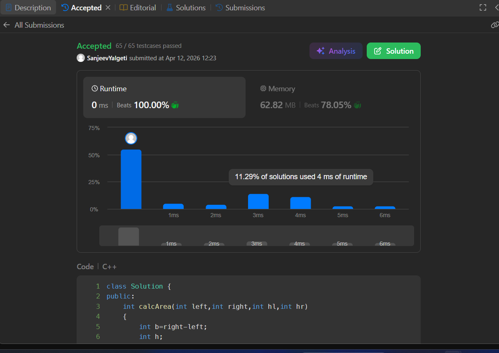

# Container With Most Water (LeetCode 11)

## 🧾 Problem Statement

Given an array height of length n, where each element represents the height of a vertical line at that index, determine the maximum amount of water that can be contained between any two lines.

The container is formed by choosing two lines and the x-axis, and the amount of water it can hold is limited by the shorter line and the distance between them.

---

## 💡 Logic

* Used two-pointer technique

* Start from both ends; left pointer increments and right decremnets. 

* It is not necessary that the highest values in the array has the highest area(water) as the breadth(difference of their indices ) can be small.

* Consider the smaller height for calculaing the area and move the pointer with lesser value in hope of getting a bigger height (if both same,can move either doest affect the output but preferably right).


---

## ⚙️ Code

```cpp
class Solution {
public:
    int calcArea(int left,int right,int hl,int hr)
    {
        int b=right-left;
        int h;
        if(hl>=hr)h=hr;
        else h=hl;
        return b*h;
    }
    int maxArea(vector<int>& height) {
        int maxVal,area,left;
        maxVal=area=left=0;
        int right=height.size()-1;
        while(left<right)
        {
            area=calcArea(left,right,height[left],height[right]);
            if (area>maxVal) maxVal=area;
            if(height[left]>=height[right])
            {
                right--;
            }
            else left++;          
        };
        return maxVal;
    }
};
```

---

## ⏱️ Time Complexity

O(n)

## 🧠 Space Complexity

O(1)

---

## 📊 Performance

* Runtime: 0 ms (beats 100.00%)
* Memory: 62.82 MB (beats 78.05%)

---

## 🖼️ Proof

