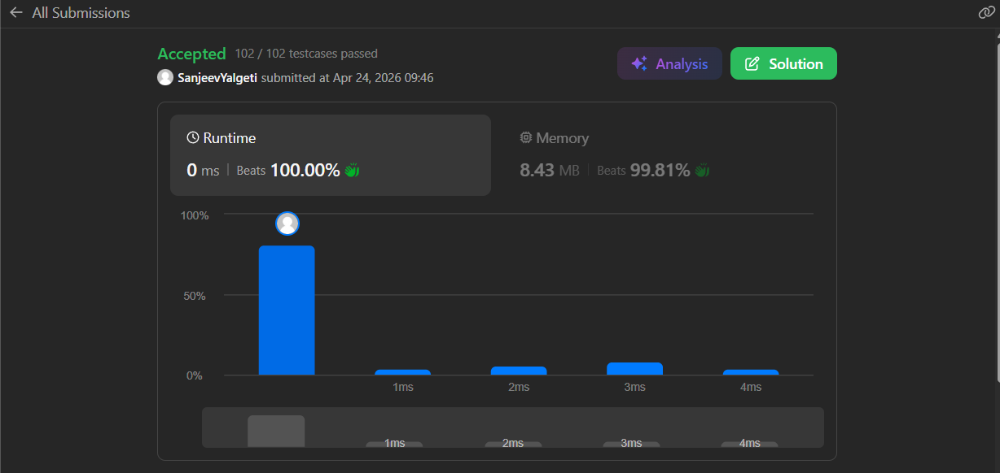

# Valid Parenthesis (LeetCode 20)

## 🧾 Problem Statement

Given a string `s` containing brackets `()`, `{}`, and `[]`, determine whether the string is valid.

A string is valid if:

* Every opening bracket has a matching closing bracket.
* Brackets are closed in the correct order.

---

## 💡 Logic

* Used a non fixed stack 

* initialize top to -1 

* Main logic is that for every element of the string, if the element is an opening bracket it is to be pushed in the stack but if the element is an closing bracket.For Every Element:-  
1.We check if stack empty ;if yes->return False else return true
2.We check if the Closing bracket corrsponds to its respective opening bracket by comparing it with current stack top;if yes->pop top i.e.(top--) else->return false because it means there is an extra closing bracket making the string invalid

* After finishing the loop we check if stack is empty .If stack not empty we return false as it shows presence of an extra opening bracket

* Previously used fixed stack of arr[10000] then modified to string.size() for memory optimization as arr[10000] is created every time even when not required.Dealt with corresponding string.size()==0 issue.
---

## ⚙️ Code

```cpp
#include <string>
using namespace std;
class Solution {
public:
    bool isValid(string s) {
        char stk[s.size()];
        int top=-1;
        if(s.size()==0)
        {
            return true;
        }
        if(s[0]==']' || s[0]==')' ||s[0]=='}')
        {
            return false;   
        }
        else{
            for(int i=0;i<s.size();i++)
            {
                if(s[i]=='[' || s[i]=='{' ||s[i]=='(')
                {
                    stk[++top]=s[i];
                }
                else if(s[i]==']')
                {
                    if(top==-1)
                    {
                        return false;
                    }
                    else if(stk[top]=='[')
                    {
                        top--;
                    }
                    else{
                        return false;
                    }
                }
                else if(s[i]=='}' )
                {
                    if(top==-1)
                    {
                        return false;
                    }
                    else if( stk[top] =='{' )
                    {
                        top--;
                    }
                    else{
                        return false;
                    }
                }
                else
                {
                    if(top==-1)
                    {
                        return false;
                    }
                    else if(stk[top]=='(' )
                    {
                        top--;
                    }
                    else{
                        return false;                
                    }
                }
            }
        }
        if(top==-1)
        {
            return true;
        }
        else return false;
    }
};
```
---

## ⏱️ Time Complexity

O(n)

## 🧠 Space Complexity

O(n)
(Worst case all opeing brackets are stored in stack)

---

## 📊 Performance

* Runtime: 0 ms (beats 100.00%)
* Memory: 8.43 MB (beats 99.81%)

---

## 🖼️ Proof

