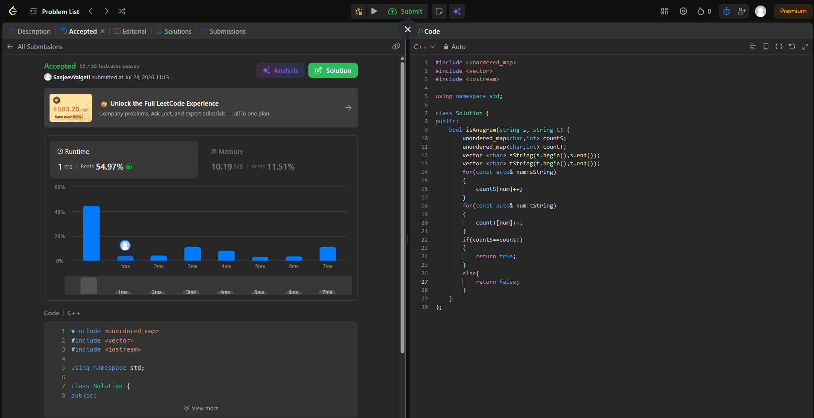

# Valid Anagram (LeetCode 242)


## 🧾 Problem Statement


Given two strings s and t, return true if t is an anagram of s, and false otherwise.
Constraints:
    * 1 <= s.length, t.length <= 5 * 104
    * s and t consist of lowercase English letters.


---


## 💡 Logic


* Anagram means two strings contain the same elements repeated the same number of times but in different order.So we try to solve this by ensuring the number of elements in both string s are same and repeat exactly the same time.

* The approach I used is using arrays/vectors.

* Two vectors are initialized containing all elements of the string s and t.

* Two unordered maps which store the elements and their counts so char,int.  

* It traverses through the vectors and counts the number of times each element has occured .

* Compare the two maps to check if equal and returns true. 


---


## ⚙️ Code


```cpp

#include <unordered_map>
#include <iostream>

using namespace std;

class Solution {
public:
    bool isAnagram(string s, string t) {
        unordered_map<char,int> countS;        
        unordered_map<char,int> countT;
        for(char c:s)
        {
            countS[c]++;
        }        
        for(char c:t)
        {
            countT[c]++;
        }        
        if(countS==countT)
        {
            return true;
        }
        else{
            return false;
        }
    }
};
```


---


## ⏱️ Time Complexity


O(m+n)
m:length of string s
n:length of string t


## 🧠 Space Complexity


O(1) or O(k)
k:no. of english alphabets stored


---


## 📊 Performance


* Runtime: 1 ms (beats 54.97%)

* Memory: 10.19 MB (beats 11.51%)


---


## 🖼️ Proof



