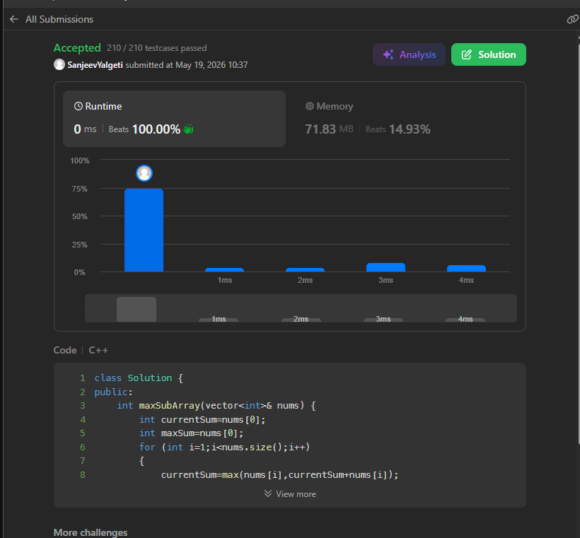

# Maximum Subarray (LeetCode 53)

## 🧾 Problem Statement

Given an integer array nums, find the subarray with the largest sum, and return its sum.

---


## 💡 Logic

* This code follows Kadanes Algorithmic Approach.
* Two variables 'currentSum' and 'maxSum' both are intialized to the 1st element.  
* It traverses through the 'nums' array starting from the left side .
* During each step, we add the current number to our running total(currentSum), then keep whichever value is larger: the new total or the previous one.
* Comapare the updated currentSum and maxSum and keep whichever is larger.
* Return maxSum.

---

## ⚙️ Code

```cpp
class Solution {
public:
    int maxSubArray(vector<int>& nums) {
        int currentSum=nums[0];
        int maxSum=nums[0];
        for (int i=1;i<nums.size();i++)
        {
            currentSum=max(nums[i],currentSum+nums[i]);
            maxSum=max(currentSum,maxSum);
        }
        return maxSum;
    }
};
```

---

## ⏱️ Time Complexity

O(n)

## 🧠 Space Complexity

O(1)

---

## 📊 Performance

* Runtime: 0 ms (beats 100.00%)
* Memory: 71.83 MB (beats 15.00%)

---

## 🖼️ Proof

