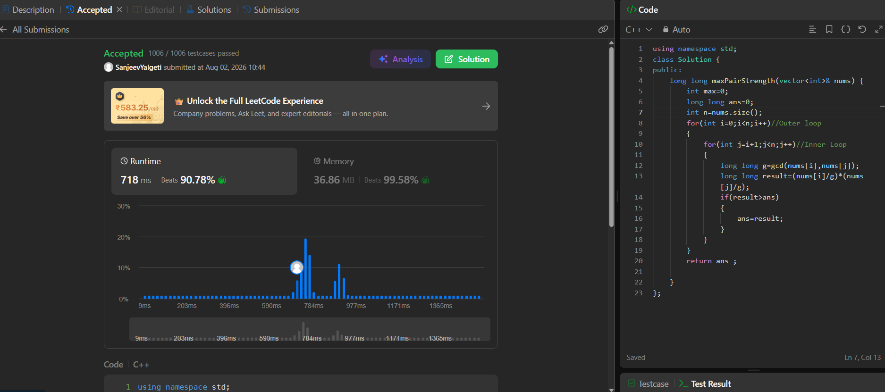

# Maximize pair strength using GCD (LeetCode 4010)
(First Leetcode Contest Sum Solved)


## 🧾 Problem Statement


You are given an integer array nums.

Choose exactly one pair of distinct indices i and j. The strength of the pair is defined as (nums[i] * nums[j]) / gcd(nums[i], nums[j])2.

Return the maximum strength over all possible pairs.

The term gcd(a, b) denotes the greatest common divisor of a and b.

 

---

## 💡 Logic

* My Approach is Number theory with bit of brute force.
 
* We create two loops nested in one another .One running from i=0 till size of the vector and nested loop running from j=i+1 to size of vector.

* In the loop we use Number Theory Concept:-
    * formula used:- strength=a*b/(gcd(a,b)^2)
    * This can be written as gx*gy/(g^2) where g is gcd(a,b).
    * Simplify to strength=x*y (g cancels out)
    *x=[a/g] and y=[a/g]

* In our solution a=nums[i] and b=nums[j]

* result stores value of strength and if result is greater than 'ans' we update 'ans'=result 


---


## ⚙️ Code


```cpp

#include <bits/stdc++.h>
using namespace std;
class Solution {
public:
    long long maxPairStrength(vector<int>& nums) {
        int max=0;
        long long ans=0;
        int n=nums.size();
        for(int i=0;i<n;i++)//Outer loop
        {
            for(int j=i+1;j<n;j++)//Inner Loop
            {
                long long g=gcd(nums[i],nums[j]);
                long long result=(nums[i]/g)*(nums[j]/g);
                if(result>ans)
                {
                    ans=result;
                }
            }
        }
        return ans ;
    }
};
```


---


## ⏱️ Time Complexity


O(n^2*logV)
since there is a nested loop.O(n^2)
logV is the time to compute gcd .


## 🧠 Space Complexity


O(1)

---


## 📊 Performance


* Runtime: 718 ms (beats 90.8.%)

* Memory: 36.86 MB (beats 99.58%)


---


## 🖼️ Proof



