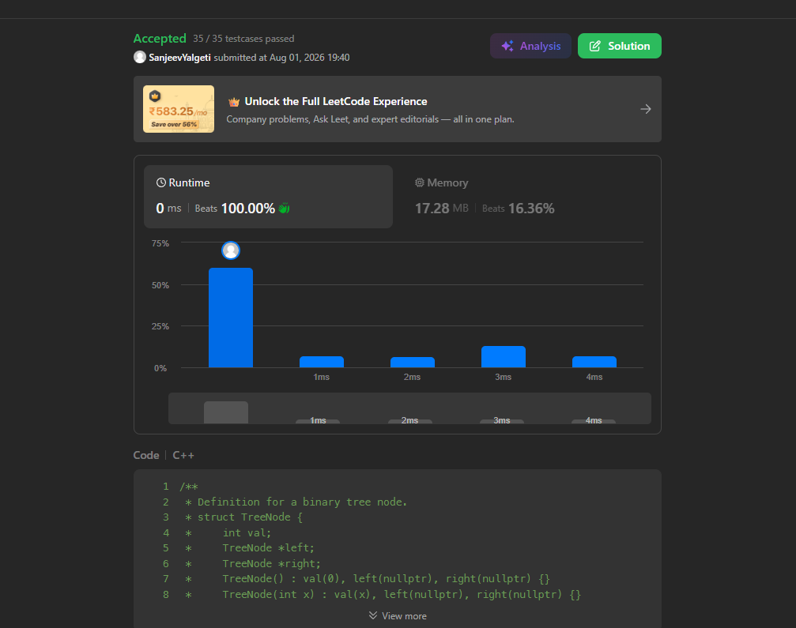

# Binary Tree Level order traversal (LeetCode 102)

## 🧾 Problem Statement

Given the root of a binary tree, return the level order traversal of its nodes' values. (i.e., from left to right, level by level).

---


## 💡 Logic

* We have to return the values of the tree level by level, from top to bottom, visiting each level from left to right.
* Create queue-'order' which stores order of nodes and nested vector result.
* Handle off case when input string is empty ,root is null and result is empty vector .
* Run a loop till order queue becomes empty and store the front most element.Push its left and right child in current level .after pushing both left and right(if tehy exist) , we push the currLevel queue into the result and move to next node  

---

## ⚙️ Code

```cpp

struct TreeNode {
    int val;
    TreeNode *left;
    TreeNode *right;
    TreeNode() : val(0), left(nullptr), right(nullptr) {}
    TreeNode(int x) : val(x), left(nullptr), right(nullptr) {}
    TreeNode(int x, TreeNode *left, TreeNode *right) : val(x), left(left), right(right) {}
};
 
#include <vector>
#include <queue>
using namespace std;    
class Solution {
public:
    vector<vector<int>> levelOrder(TreeNode* root) {
        if (root == NULL)
        {
            return {};
        }
        queue<TreeNode*> order;
        vector<vector<int>> result;
        order.push(root);
        while(!order.empty())
        {
            int queueSize=order.size();
           
            vector<int> currLevel;
            while(queueSize)
            {
                TreeNode* curr=order.front();
                currLevel.push_back(curr->val);
                if(curr->left)
                {
                order.push(curr->left);
                }
                if(curr->right)
                {
                order.push(curr->right);
                }
                queueSize--;
                order.pop();
            }
            result.push_back(currLevel);
        }
        return result;
    }
};
```

---

## ⏱️ Time Complexity

O(n)

## 🧠 Space Complexity

O(n)

---

## 📊 Performance

* Runtime: 0 ms (beats 100.00%)
* Memory: 17.28 MB (beats 16.36%)

---

## 🖼️ Proof

